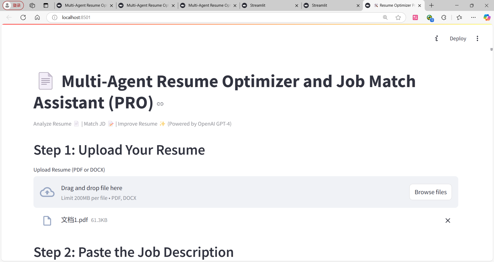

# 📄 Multi-Agent Resume Optimizer and Job Match Assistant (PRO)

🚀 This is an AI-powered resume analyzer and job matcher, designed to help candidates improve their resume based on a target job description.  
It uses OpenAI's GPT-4 to deeply extract resume and JD skills, find missing areas, and suggest improvements.

---

## ✨ Features

- 📑 Upload Resume (PDF or DOCX)
- 📝 Paste Job Description
- 🤖 Analyze Resume Skills (Technical, Programming, Tools, Soft Skills, Certifications)
- 📋 Analyze JD Requirements (Technical, Tools, Soft Skills, Certifications)
- 🔍 Find Skill Gaps between Resume and JD
- 📊 Calculate Resume-to-JD Matching Score
- 🛠 Suggest Missing Skills and Bullet Points to Improve Resume
- 🎯 Powered by GPT-4, Streamlit UI
- 💬 Clean UI, fast analysis, helpful recommendations


## 🏗️ Project Architecture
multi_agent_resume_optimizer/ ├── agents/ │ ├── resume_analyzer.py │ ├── jd_reader.py │ ├── gap_finder.py │ └── resume_rewriter.py ├── utils/ │ ├── prompts.py │ └── file_reader.py ├── assets/ │ └── demo_screenshot.png ├── app.py ├── requirements.txt ├── README.md ├── .env (not uploaded) └── venv/ (not uploaded)
- **agents/** → All AI agents (resume, JD, gap finder, rewriter)
- **utils/** → Helper functions (prompts and file readers)
- **assets/** → Demo screenshots and images

## ⚙️ Installation and Setup

1. **Clone the repository:**

```bash
git clone https://github.com/your_username/multi_agent_resume_optimizer.git
cd multi_agent_resume_optimizer
Create and activate a virtual environment:
python -m venv venv
.\venv\Scripts\activate  # Windows
source venv/bin/activate # Mac/Linux
Install dependencies:
pip install -r requirements.txt
Add your OpenAI API key to .env:

OPENAI_API_KEY=your_openai_api_key_here
Run the app:
streamlit run app.py
✅ The app will open at http://localhost:8501

📷 Demo Screenshot


🎯 Future Improvements
Integrate Gemini API as fallback
Support PDF output reports
Multi-JD matching for resume optimization
Direct LinkedIn Job fetching integration
Resume autogeneration using missing skills (future GPT-4o)
📄 License
This project is for educational and portfolio purposes.
© 2025 Kartik703 — All rights reserved.

